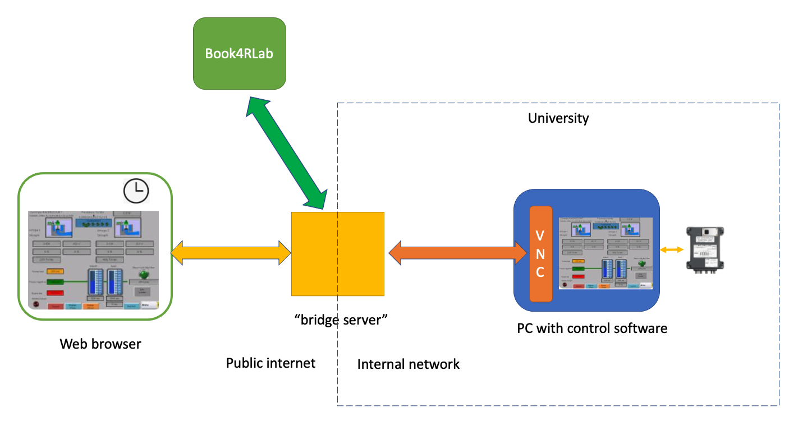

# Bridge Server for Book4RLab
This is a "bridge server" for Remote Desktop solution for Remote Labs integration with [Book4RLab](https://github.com/eubbc-digital/Book4RLab) reservation system. 
It is based on [noVNC](https://github.com/novnc/noVNC) and uses VNC communication to connect the Lab's controller system.

The bridge server must be installed in a computer that has a public IP address and a DNS name, so that remote users can access the remote lab.
The bridge server host should be able to communicate with the computer that has the Lab controller software (e.g. a Windows PC) that has a VNC server installed. Typically this computer should be in an isolated network.
The bridge server has already all the integration with Book4RLab. Only users who reserved a time slot in Book4RLab will be able to access the Remote Lab without providing any password.


## Getting Started
The installation of the brigde server is simplified using Docker technology.

### Prerequisites
You will need to have Docker and Docker Compose installed on the host that will run the bridge server. We recommend to use Linux (e.g. Ubuntu). 
Here is a tutorial to [install Docker in Ubuntu](https://docs.docker.com/engine/install/ubuntu)
Here is a tutorial to [install Docker Compose in Ubuntu](https://www.digitalocean.com/community/tutorials/how-to-install-and-use-docker-compose-on-ubuntu-20-04)
For the host with the VNC server, please install [TightVNC server](https://tightvnc.com) 

### Building the Bridge Server
Clone the repository and enter the bridgeserver directory.

`git clone https://github.com/eubbc-digital/bridgeserver`

`cd bridgeserver`

Next, build the service. This make take several minutes...

`docker-compose build`

Once the build is ready, the Docker image of the bridgeserver will be ready for deployment. You only need to configure some parameteres.

### Configuration of the Bridge Server

You need to edit the `server.env` file to set the following parameters:
- `PASSWORD`: The VNC password for full control that you configured in the TightVNC Server. This is for private sessions reserved in Book4RLab.
- `VIEW_ONLY_PASSWORD`: The VNC "view only" password for public sessions reserved in Book4RLab. This allows other remote lab users to only see what other student is doing, but not to control the remote equipment. 
- `BOOKING_URL`: The Book4RLab URL for validation of sessions. By default it points to the centralized Booking System at `https://eubbc-digital.upb.edu/booking/`
- `VNC_SERVER_IP_ADDRESS`: The VNC server ip address of your Remote Lab.
- `VNC_SERVER_PORT`: The VNC server port. By default, VNC server use port `5900`. Please check the TighVNC server setting.

### Running the Bridge Server
Once configured, you can deploy the service running the following command:

`docker-compose up -d`

This command will deploy the service permanently, even if the host is rebooted.

You can now access the Remote Lab bridge service through a web browser using the host name of the bridge server:

`http://name_of_server:3000`

### Stopping the Bridge Server
To stop the service, you can simply running the following command: 
`docker-compose down`

### Customizing the port on the bridge server
You can customize the port of the bridge server, for example, to use the default HTTP port 80. 
Simply, change the following line in the `docker-compose.yml` file:

```
ports:
  - "3000:3000"
```
to
```
ports:
  - "80:3000"
```
Then you will be able to access the remote lab directly through `http://name_of_server`


Is not recommended to change the port:
```
- "6080:6080"
```
Because this is the default port that is proxying the websocket traffic between the VNC server and the webpage.

## Using Book4RLab with your Remote Lab
In order to avoid sharing the VNC password with the students, the bridge server automatizes the access to the VNC Server without exposing the password. 
The student can book a time slot in the Book4RLab system, and the credentials will be validated by the bridge server, and automatically connect to the VNC session. 

### Instructors's Registration of your Remote Lab in Book4RLab
- The instructor needs to register the URL of the bridge server in the Book4RLab instance that is used. Please follow the instructions described [here](https://github.com/eubbc-digital/Book4RLab/wiki). The instructor needs to ask for special instructor access to the Book4RLab admnistrator. 
- The instructor creates a Lab in Book4RLab pointing to the bridge server `http://name_of_server` and gives a name to the Lab.

### Students reservation of a time slot. 
- The students can book a time slot for the Remote Lab registered by the instructor, depending on the available time slots. 
- The reservation will generate a URL and a QR code, containing the URL of the bridge 
server, which will include an `access_key` and a `pwd` parameters (only `access_key` if 
the session is public). 
- The generated URL (e.g. `http://name_of_server?access_key=xxxxxxxxxx&pwd=yyyyy`, where 
`xxxxxxxxxx` is the key to validate the reservation and `yyyyy` is the key to validate a
 private reservation. 
  

## Authors

 - Boris Pedraza (Universidad Privada Boliviana - UPB)
 - Alex Villazon (Universidad Privada Boliviana - UPB)

## Acknowledgments

This work was partially funded by the Erasmus+ Project “EUBBC-Digital” (No.
618925-EPP-1-2020-1-BR-EPPKA2-CBHE-JP)


## License
This project is licensed under the MIT License - see the LICENSE file for details.

## More Information
For more information about the project, please visit our [website](https://eubbc-digital.upb.edu/).
Please visit our [Book4RLab git repository](https://github.com/eubbc-digital/Book4RLab/).
